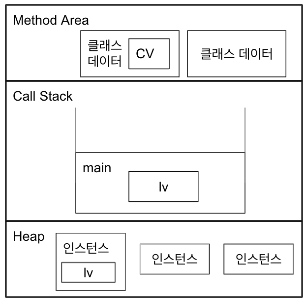

# 클래스와 객체

## 클래스와 객체의 정의와 용도

- **클래스** : 객체를 정의해놓은 것 | 객체의 설계도 또는 틀

- **객체** : (프로그래밍)클래스에 정의된 내용대로 메모리에 생성된 것

## 객체와 인스턴스

- **인스턴스화(instantiate)**: 객체를 만드는 과정

- 클래스 --- 인스턴스화 ---> 인스턴스(객체)

## 객체 구성요소 - 속성과 기능

- 속성(property): 멤버변수, 상태

- 기능(function): 메서드, 함수, 행위

## 인스턴스의 생성과 사용

**예제 1**

```java
class Tv{
    String color;
    int channel;

    void power() { power = !power };
}
class TvTest{
    public static void main(String args[]){
        Tv t;
        t = new Tv();
        t.channel = 7

    }
}
```

1. `Tv t;`
   - Tv 클래스 타입의 참조변수 t를 선언
   - 메모리에 t를 위한 공간 마련
2. `t = new Tv();`
   - new -> 인스턴스가 메모리 의 빈 공간에 생성
   - 후에 대입연산자(=)에 의해 생성된 객체의 주소값이 참자변수 t에 저장된다.(빈공간 -> 0x100)
3. `t.channel = 7`
   - 참조변수 t에 저장된 주소에 있는 인스턴스의 멤버변수 channel에 7 저장

<br>

**예제 2**

```java
class Tv{
    String color;
    int channel;

    void power() { power = !power };
}
class TvTest{
    public static void main(String args[]){
        Tv t1 = new Tv(); // (주소값: 0x100)
        Tv t2 = new Tv(); // (주소값: 0x200)
        t2 = t1;   // (주소값: 0x100)
        t1.channel = 7;
    }
}
```

1. ```java
   t2 = t1
   ```

   - t1은 참조변수 -> 인스턴스의 주소를 저장
   - 해당 코드 실행시 t2는 t1이 참조하고 있던 인스턴스를 같이 참조하게 된다. (주소값: 0x100)

   - **각 인스턴스는 같은 주소를 공유할 수 있다.** 하지만 하나의 인스턴스가 동시에 여러 주소값을 가질 수는 없다.

<br>

## 객체 배열

```java
Tv tv1, tv2, tv3; -> Tv[] tvArr = new Tv[3]; // 참조변수 배열(객체 배열)을 생성

```

- 여러 객체를 배열로 다루게 될 경우, 각각의 인덱스엔 객체의 주소가 저장된다.
- 객체 배열 생성은 그저 참조변수들이 만들어진 것일뿐 빈 공간이다. 따라서 각 요소에 객체를 생성해서 저장해야한다.

```java
Tv tv1, tv2, tv3; -> Tv[] tvArr = new Tv[3]; // 참조변수 배열(객체 배열)을 생성

tvArr[0] = new Tv();
tvArr[1] = new Tv();
tvArr[2] = new Tv();

```

- 해당 내용은 배열의 초기화 블럭을 통해 축약할 수 있다.(for문 사용도 용이함)
  ```java
  Tv[] tvArr = { new Tv(), new Tv(), new Tv() };
  ```

<br>

# 변수와 메서드

## 선언 위치에 따른 변수의 종류

```java
class Variables{                      // ---> 클래스 영역
    int iv;         // 인스턴스 변수
    static int cv;  // 클래스 변수(static변수, 공유변수)

    void method(){                    //
        int lv = 0; // 지역 변수        // --> 메서드 영역
    }
}
```

|  변수의 종류  |                       선언위치                       |          생성시기           |
| :-----------: | :--------------------------------------------------: | :-------------------------: |
|  클래스 변수  |                     클래스 영역                      | 클래스가 메모리에 올라갈 때 |
| 인스턴스 변수 |                     클래스 영역                      |  인스턴스가 생성되었을 때   |
|   지역 변수   | 클래스 영역 이외의 영역(메서드, 생성자, 초기화 블럭) | 변수 선언문이 수행되었을 때 |

1. **인스턴스 변수**

   - static이 붙지 않음
   - 클래스 영역에 선언되며, 클래스의 인스턴스를 생성할 때 만들어진다.
   - 인스턴스는 독립적인 저장 공간을 가지므로 서로 다른 값을 가질 수 있다.
   - 인스턴스마다 고유한 상태를 유지해야하는 경우, 이를 활용

2. **클래스 변수**

   - **static**을 붙음

   - **모든 인스턴스가 공통된 저장공간(변수)을 공유**
   - 인스턴스 생성 없이 바로 사용할 수 있다.
   - '**클래스이름.클래스변수**'의 형식을 지닌다.
   - 클래스가 메모리에 '**로딩(loading)**'될 때 생성
   - 프로그램이 종류될 때까지 유지된다.
   - public을 추가로 붙일 시 '**전역변수(global variable)**'의 성격을 갖는다.

3. **지역 변수**

   - 메서드 내에서만 사용 가능

   - 메서드 종료시 소멸

<br>

## 클래스 변수와 인스턴스 변수

**예제 1 카드\_클래스 정의**

```java
class Card{
    // 인스턴스 변수
    String Kind; // 무늬
    int number;  // 숫자
    // 클래스 변수
    static int width = 100; //폭
    static int height = 250; //높이
}
```

- 무늬, 숫자 : 자신만의 값(하트, 클로버)을 유지해야하므로 **인스턴스 변수**로 선언

- 폭, 넓이 : 모든 카드가 동일한 값을 가지므로 **클래스 변수**로 선언

## 메서드

### 메서드의 실행 흐름

---

- 같은 클래스 내의 메서드끼리는 참조 변수 없이 서로 호출 가능
- static 메서드는 같은 클래스 내의 인스턴스 메서드를 호출할 수 없다.

```java
class MyMath {
    long add(long a, long b) {
        return a + b;
    }
    long subtract(long a, long b) { return a - b };
    long multiply(long a, long b) { return a * b };
    double divide(double a, double b) { return a / b };
}
```

- 해당 클래스의 add 메서드를 호출하기 위해서는 먼저 `MyMath mm = new MyMath();` 와 같이 인스턴스 생성 후, 참주 변수 mm을 통해야한다.

```java
public static void main(String args[]) {

    MyMath mm = new MyMath(); // 인스턴스 생성

    long value = mm.add(1L, 2L);    //메서드 호출

    // long add(long a, long b){
    //     return a + b
    // }
}
```

**코드 실행 순서**

1. main 메서드에서add 호출 -> 인자 값이 매개변수 a,b에 각각 복사된다.

2. add의 괄호 안 문장들이 순서대로 수행

3. return 문을 통해 메서드 탈출

<br>

### **JVM의 메모리 구조**

---



**메서드 영역(Method Area)**

- 프로그램 실행 중 클래스 사용 -> JVM은 해당 클래스의 클래스파일을 분석 -> 해당 클래스 데이터를 이곳에 저장

- 클래스의 클래스 변수도 이 영역에 생성

<br>

**힙(heap)**

- 인스턴스가 생성되는 공간

- 인스턴스 변수들이 쌩성되는 공간

<br>

**호출스택(Call Stack || Execution Stack)**

- 메서드 작업에 필요한 메모리 공간 제공

- 해당 메모리는 메서드 작업 수행 동안 연산이나 지역변수 할당에 사용

- 메서드 작업 종료시 메모리는 반환된다.

- 호출 순서대로 호출 스택 맨 밑부터 작업 공간이 마련된다.

- 즉, 아래에 있는 메서드가 바로 위의 메서드를 호출한 메서드이다.

<br>

### 기본형 매개변수와 참조형 매개변수

메서드 호출시, 매개변수로 지정된 값을 복사해서 넘겨주는 이는 매개변수 타입에 따라 넘겨주는 값이 달라진다.

- **기본형 매개변수(primitive type)**

  - 기본형 값이 복사
  - 변수의 값을 읽기만 할 수 있다. (read only)

- **참조형 매개변수(reference type)**
  - 인스턴스의 주소 복사
  - 변수의 값을 읽고 변경할 수 있다. (read & write)

```java
class Data { int x; }

public class PrimitiveParamEx {
    public static void main(String[] args) {
        Data d =  new Data();
        d.x = 10;
        System.out.println("main() : x = " + d.x);

        change(d.x);
        System.out.println("After change(d.x)");
        System.out.println("main() : x = " + d.x);
    }
    static void change(int x) { //기본형 매개변수
        x = 1000;
        System.out.println("change() : x = " + x);
    }
}
```

**result**

```
main() : x = 10
change() : x = 1000
After change(d.x)
main() : x = 10
```

1. change 메서드가 호출되면서 d.x가 change메서드의 매개변수 x에 복사됨

2. change 메서드에서 x의 값을 1000으로 변경

3. change 메서드가 종료되면서 매개변수 x는 스택에서 제거

**이처럼 기본형 매개변수는 변수에 저장된 값만 읽을 수 있고 변경되지 않는다.**

```java
class Data { int x; }

class ReferenceparamEx {
    public static void main(String[] args) {
        Data d =  new Data();
        d.x = 10;
        System.out.println("main() : x = " + d.x);

        change(d);
        System.out.println("After change(d)");
        System.out.println("main() : x = " + d.x);
    }
    static void change(Data d) { // 참조형 매개변수
        d.x = 1000;
        System.out.println("change() : x = " + d.x);
    }
}
```

**result**

```
main() : x = 10
change() : x = 1000
After change(d)
main() : x = 1000
```

1. change 메서드가 호출되면서 참조변수 d의 값(주소)이 매개변수 d에 복사됨.

2. change 메서드에서 매개변수 d로 x의 값을 1000으로 변경

3. change메서드가 종료되면서 매개변수 d는 스택에서 제거

**매개변수가 참조형이라 값이 아닌 '값이 저장된 주소'를 전달  
-> read & write**

<br>

> **반환타입이 '참조형'이라는 것 = 메서드가 '객체의 주소'를 반환**, p.269

### 재귀호출(Recursive Call)

```java
void method(int n) {
        if(n == 0)
            return;
        System.out.println(n);
        method(n--);
    }
```

- 메서드 호출은 매개변수 복사와 종료 후 복귀할 주소저장 등, 반복문 보다 처리 시간을 증가시키는 요인이 많다.

- 하지만 논리적 간결함 때문에 이를 사용한다.
  - ex) 팩토리얼  
    `f(n) = n * (n-1), 단 f(1) = 1`
  ```java
  static int factorial ( int n){
      if( n == 1) return 1;
      return n * factorial ( n - 1 );
  }
  ```

### 클래스 메서드(static 메서드)와 인스턴스 메서드

- 클래스 메서드(static 메서드)
  - 인스턴스와 관계 없는 메서드를 정의할 때 사용
  - 인스턴스를 생성하지 않아도 사용할 수 있다.  
    (static -> 클래스가 메모리에 올라갈 때 자동적으로 생성)
  - 인스턴스 변수를 사용할 수 없다.

### 클래스 멤버와 인스턴스 멤버간의 참조와 호출

- 클래스 멤버를 참조 또는 호출하고자 하는 경우에는 **인스턴스를 생성**해야한다.  
  -> 인스턴스 멤버가 존재하는 시점에 클래스 멤버는 항상 존재하지만,  
  **클래스 멤버 존재 시점에 인스턴스 멤버는 존재하지 않을 수 있기 때문에**.
